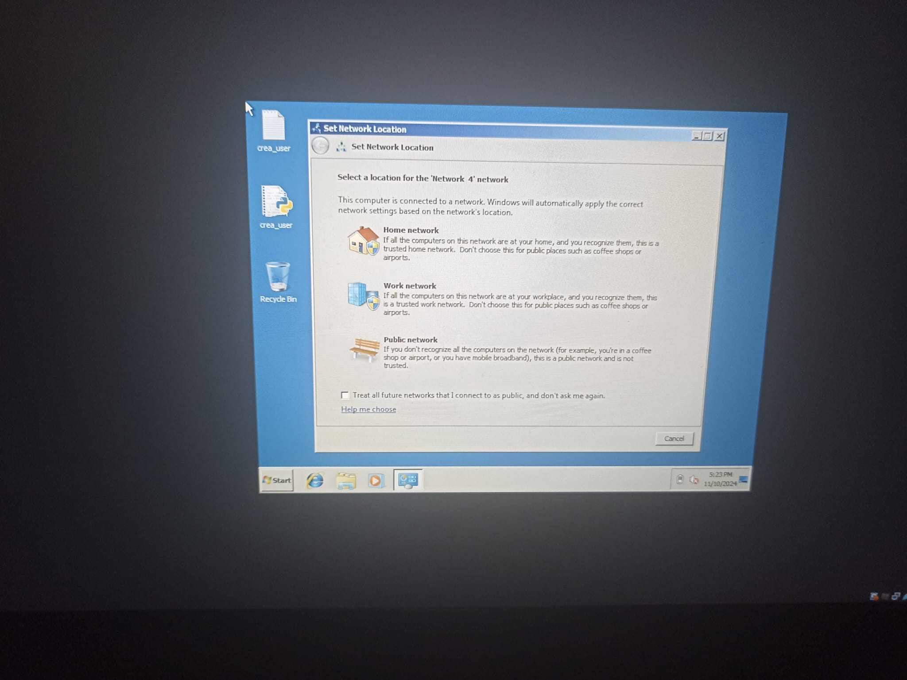

# Adquisición de la evidencia

### **Documentación Inicial de la Escena**

Durante la adquisición de la evidencia, se realizó la documentación exhaustiva del estado de la escena y de los dispositivos presentes, siguiendo los principios forenses para asegurar la trazabilidad de cada elemento:

* **Presencia de dispositivos en la escena:**  
  * **Marca, modelo y número de serie**: En el caso del dispositivo identificado, se registró como **Máquina Windows 7**. No se dispone de número de serie ya que es una máquina virtual en un entorno de práctica.  
  * **Ubicación exacta**: El dispositivo virtual está ubicado dentro del entorno controlado de VirtualBox.  
  * **Estado del dispositivo**: El dispositivo estaba en vivo, y mostró la ventana de selección de configuración de red al inicio del proceso.  
* **Fotografías de la Escena:**



* **Etiquetado del Dispositivo:**  
  * **Código Único**: Se le asignó el código **VM-001** para identificarlo en el proceso.  
  * **Etiqueta de Evidencia**: La máquina virtual fue etiquetada virtualmente con el identificador **VM-001** en la documentación.

### **Capturas de datos volátiles**

En esta sección se documenta el proceso de adquisición en vivo de evidencias digitales, siguiendo el orden de volatilidad para maximizar la preservación de datos. El objetivo principal de la adquisición en vivo es preservar la memoria volátil y otros elementos temporales del sistema, asegurando siempre la integridad de los datos durante la recolección.

##### **Captura de la memoria RAM**
Para obtener la memoria RAM , se ha utilizado la herramienta ```RamCapturer64``` . Esta herramienta permite realizar un volcado completo de la memoria RAM sin afectar la integridad de los datos.


Una vez completada la captura, se ha procedido a calcular los valores hash, utilizando los algoritmos MD5 y SHA-1 para asegurar la integridad del archivo de volcado. Los hashes calculados nos permiten verificar que el volcado de memoria no ha sido alterado durante su almacenamiento o transferencia.

|Nombre|hash|
|-|-|
|md5|7412d141d11af0bd304975f943c4e1e3|
|sha1|b4f79ca54f4bba663cd59fcbb32d9b61b614c447|

##### 	**Adquisición de el disco duro**

Para hacer una adquisición del disco duro se ha utlizado ```FTK imager```. Esta herramienta permite generar una copia exacta del contenido del disco, preservando toda la información y asegurando la integridad de los datos adquiridos.

Se rellenaron los datos del caso en la interfaz de FTK Imager, incluyendo el número de caso VM-001, número de evidencia 001, y una descripción única del dispositivo como hard disk copy. Además, el nombre del examinador, Alejandro Díaz Barea, se incluyó para identificar al responsable del proceso.


A continuación, se seleccionó la ubicación de destino para almacenar la imagen del disco y se eligió el formato raw, un formato común para adquisiciones forenses que facilita el análisis posterior sin modificar la estructura de los datos. La copia de la imagen se generó con éxito, preservando todos los sectores del disco.


Finalmente, se calcularon los valores hash (MD5 y SHA1) del archivo de imagen generado para asegurar la integridad de los datos y verificar que no se produjeron alteraciones durante el proceso de copia.


| Nombre | Hash                                    |
| ------ | --------------------------------------- |
| md5    | 5708010b9ba58a7bfcd33b8cd124eeeb        |
| sha1   | cb38cce7a61b9b0f4619796bd10aea18a49fdd5 |


##### **Triaje de el disco duro**

Durante el proceso de triaje del disco duro se utilizó la herramienta ```FTK Imager``` para identificar y extraer archivos temporales, enlaces (links), cookies, y favoritos del sistema. Estos elementos fueron seleccionados para proporcionar una visión detallada del comportamiento del usuario, identificando lo más utilizado y cualquier rastro potencial de actividad sospechosa.


Una vez completado el triaje, se procedió a calcular los valores hash (MD5 y SHA-1) de los datos recolectados

| Nombre | Hash                                    |
| ------ | --------------------------------------- |
| md5    | f0e9d4e865b42e4d9e1f9a467b3e1e5d        |
| sha1   | 5a7c6d8e0b3c4f5b2e4d1a8b8c7d6f4e3b2a1f90|


##### **Adquisición de logs del sistema** 
Para la obtención de los registros de actividad del sistema, se utilizó la herramienta LastActivityView, la cual permite capturar y visualizar eventos relevantes que muestran un rastro detallado de las acciones del usuario y del sistema. Esto incluye actividades como aperturas de archivos, ejecución de programas, conexiones a redes y otros eventos importantes para el análisis forense.


### **Cadena de custodia**

##### Formulario de Cadena de Custodia para Evidencias Digitales

~~~

1. Número de caso / Identificador único: **VM-001**

2. Descripción detallada del dispositivo:

   - Tipo de dispositivo: Máquina Virtual
   - Marca: Windows
   - Modelo: Windows 7
   - Número de serie: N/A (Máquina virtual sin número de serie)
   - Características adicionales: Configuración para práctica forense

3. Recolección:

   - Fecha: 0/11/2024
   - Hora: 17:35 hrs
   - Lugar de recolección: Entorno controlado VirtualBox

4. Recolector:

   - Nombre completo: Alejandro Díaz Barea
   - Cargo/Institución: C.E Ciberseguridad
   - Firma: Alejandro Díaz Barea

5. Estado del dispositivo al momento de la recolección:
   El dispositivo estaba encendido al inicio de la adquisición, en un escenario en vivo, mostrando la ventana de selección de configuración de red.

6. Observaciones adicionales:
   El dispositivo es una máquina virtual Windows 7. La adquisición se realizó siguiendo el orden de volatilidad para asegurar la preservación de los datos.

Certifico que la información proporcionada en este formulario es verdadera y precisa según mi mejor conocimiento.

Firma del recolector: Alejandro Díaz Barea Fecha: 10/11/2024
~~~


##### Documentación detallada

Elaboraremos un informe detallado, incluyendo hora, fecha, todos los procedimientos realizados en detalle, etc. De forma que quede todo registrado de la forma mas detallada, precisa y completa posible. 

- Tabla de acciones y resultados:

| Hora  | Acción                           | Herramienta utilizada | Resultado/Observación                    |
|-------|----------------------------------|-----------------------|------------------------------------------|
| 17:53 | Aseguramiento de la escena       | N/A                   | Área acordonada, acceso restringido      |
| 17:54 | Documentación fotográfica inicial | Cámara digital       | Capturas de la disposición de la escena  |
| 17:55 | Verificación del estado del sistema | N/A               | Dispositivo encendido y en espera       |
| 17:57 | Identificación de dispositivo    | N/A                   | Computadora de escritorio (Windows 7)    |
| 18:00 | Inicio de captura de la memoria RAM | RamCapturer64     | Volcado completo realizado sin incidentes|
| 18:05 | Cálculo de hashes de la memoria RAM | MD5 y SHA-1       | Hashes calculados y registrados          |
| 18:10 | Preparación para copia de disco  | FTK Imager           | Configuración completada para copia      |
| 18:15 | Inicio de adquisición de disco   | FTK Imager           | Creación de imagen en formato raw        |
| 18:30 | Cálculo de hashes del disco      | MD5 y SHA-1          | Hashes generados y registrados           |
| 18:35 | Extracción de datos temporales (triaje) | FTK Imager     | Archivos temporales y enlaces extraídos  |
| 18:40 | Cálculo de hashes del triaje     | MD5 y SHA-1          | Integridad de datos confirmada           |
| 18:45 | Adquisición de logs del sistema  | LastActivityView     | Captura de logs completa                 |
| 18:50 | Cálculo de hashes de los logs    | MD5 y SHA-1          | Hashes generados para verificación       |
| 18:55 | Finalización y etiquetado de evidencia | N/A             | Código único asignado: VM-001           |
| 19:00 | Revisión final de integridad     | N/A                   | Verificación completa y almacenamiento seguro |


### **Transferencia de evidencia a medio externo**

Durante el proceso de documentación y adquisición de evidencia, se utilizó un pendrive para la transferencia segura de los archivos generados, incluyendo volcados de memoria, copias de disco y logs del sistema. 

- **Dispositivo de transferencia:** Pendrive USB Kingston 32GB
- **Código de evidencia del pendrive:** **USB-001**
- **Contenido transferido:**  
  - Volcado de memoria RAM
  - Imagen de disco en formato raw
  - Logs del sistema adquiridos con LastActivityView
  - Archivos temporales y datos del triaje del disco

Para respaldar la integridad de la evidencia y facilitar el acceso remoto seguro, los archivos se han subido a un servidor seguro. El acceso a estos archivos se puede realizar mediante la siguiente URL:

- **URL de acceso a la evidencia:** [[https://servidor-seguro.com/evidencias/VM-001](https://drive.google.com/drive/folders/1vVx4PqRr3vmDsYtXdnxg-NKSrTgTZwmy?usp=drive_link)]([https://servidor-seguro.com/evidencias/VM-001](https://drive.google.com/drive/folders/1vVx4PqRr3vmDsYtXdnxg-NKSrTgTZwmy?usp=drive_link))  


